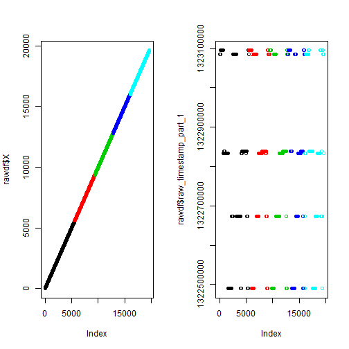
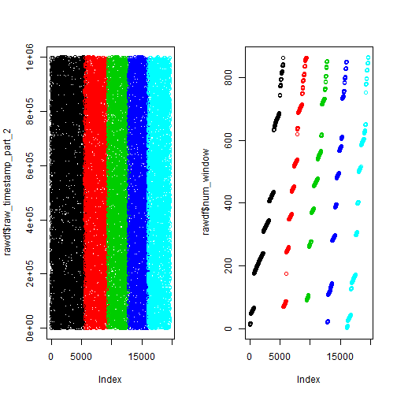
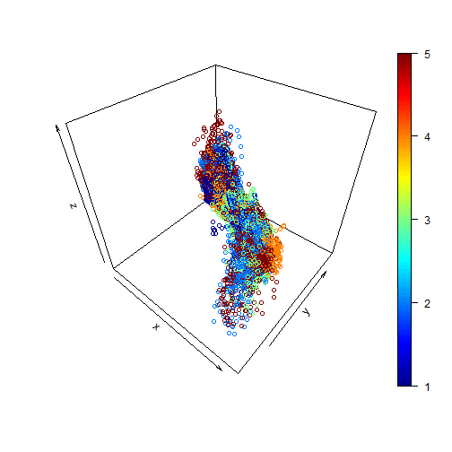

Prediction of Proper Dumbbell Exercise Movement
===============================================

by Dave Martin

Synopsis: Six volunteers were asked to perform dumbbell lifting exercises.  Time series data was collected from sensors that were attached to the volunteers while they were performing the dumbbell lifting exercises.  These movement were classified into five categories: A, B, C, D, E and labelled in the data-set as "classe".  Category A movements are the correct ones, i.e., they are proper in form, the other four had certain mistakes (purposefully) made.  The purpose of this study is to employ machine learning to predict which of the exercises were done correctly from the observations of input data.  We will treat each line of observation as being considered one independent observation.

Notes:

1. The original data was collected and arranged in a sliding-window fashion.  However, we shall treat each line of observaton as an independent observation.

2. Due to length requirement (<2000 words, fewer than 5 graphs) of the project, some of the exploratory work was done off this document, for instance, str(rawdf) and summary(rawdf), etc.  In some other cases, one graph was plotted to illustrate the idea because multifaceted/multipanel plots could not provide the details needed.

## Loading the Data Set ##

First the data is loaded -- from previous exploratory work, we know that there were many blank and NA entries, so we set the parameters to anticipate this fact, stringsAsFactors was set to false to preserve the mostly numerical data as much as possible:


```r
## read in and replace null strings s NA, in addition, keep existing NA

rawdf <- read.csv("http://d396qusza40orc.cloudfront.net/predmachlearn/pml-training.csv", 
    stringsAsFactors = FALSE, na.strings = c("", NA))
```


Inspect the data by calling str(rawdf, list.len=160) and summary(rawdf).  This is done off the document so as not to clutter this report.  There were a lot of blanks and NA's as well as variables that were used for housekeeping such as names of the volunteers (user_name).  Those are studied in-depth for potential cleaning up.

## Cleaning the Data Set ##

#### Leakage: problem variables must be removed ####

There were independent variables that seem like indexes (first 7 variables).  These can have leakage effects on the machine learning algorithm (see https://www.kaggle.com/wiki/Leakage).  It is one of the worst problems to have in building a successful machine learning product because it causes the learner to "cheat" by (over) fitting the leakage variables to the dependent variable.  **Often, these variables will cause the learners to train and even test very well but are likely to perform very poorly when deployed and given "real" data.**

In this kind of prediction, **it is best to include only sensor derived data** and leave out indexing and "house-keeping" variables such as time-stamps, windows indices, and user names.  

To understand this, visualize the **non-sensor** derived data -- note that exploratory plots are done quickly without spending too much effort or time to prettify these plots:


```r
par(mfrow = c(1, 2))

plot(rawdf$X, col = as.factor(rawdf$classe))
plot(rawdf$raw_timestamp_part_1, col = as.factor(rawdf$classe))
```

 

```r

par(mfrow = c(1, 2))
plot(rawdf$raw_timestamp_part_2, col = as.factor(rawdf$classe))


plot(rawdf$num_window, col = as.factor(rawdf$classe))
```

 


It is obvious that these variables (up to the first 7 in the raw data-set) will have leakage effects -- the colourised regions are too neatly grouped and will cause overfitting.  These need to be removed.

The following visualization is shown in contrast to the above plots.  This is an example that shows data that are better suited as training data inputs.  The variables are gyros\_arm\_x, gyros\_arm\_y and gyros\_arm\__z.  As in the earlier plots, the dependent variable, i.e., classe, is used to colour the points.  The plotted data show that they are not artificially or neatly segmented into regions of rectangles or steps, etc. These are data from one of the sensors.  In addition, notice that the coloured regions seem to cluster, even if in a disjointed way, i.e., there are two or three "blobs" of a single colour that are not connected.  This seems to be the kind of data that decision trees can be quite good at:


```r
## this is an exploratory plot, so no effort is put into making it pretty
## with nice labels

library(plot3D)

with(rawdf, scatter3D(x = gyros_arm_x, y = gyros_arm_y, z = gyros_arm_z, colvar = as.numeric(as.factor(classe))))
```

 


Alternatively one can plot the above graph with the ability to rotate the frame using the "rgl" package.  This generates an interactive 3D scatterplot that allows one to rotate the frame for better perspectives.  The following code (not run in this document) does the job:


    library(rgl)
    
    with(rawdf, plot3d(gyros_arm_x, gyros_arm_y, gyros_arm_z, col=as.numeric(as
    .factor(classe))))

A (potentially) computationally expensive way to determine leakage problems with variables is simply to run a machine learning algorithm based on a single independent (observation) variable against the dependent variable.  If the single variable is highly accurate and it is not even a sensor data, the varaible should be discarded as it is likely to be a leakage variable.  For instance:


```r
## use only the X variable in the original data set
xdf <- rawdf[, c("X", "classe")]

## partition the subsetted data set
library(caret)
set.seed(1234)
trainidx <- createDataPartition(xdf$classe, p = 0.8, list = F, times = 1)
x.train <- xdf[trainidx, ]
x.test <- xdf[-trainidx, ]

## train the learner with X to classe using random forest
library(randomForest)
xrf.fit <- randomForest(factor(classe) ~ ., data = x.train, ntree = 30, keep.forest = TRUE, 
    importance = TRUE)

## check the fitted predictor
xrf.fit
```

```
## 
## Call:
##  randomForest(formula = factor(classe) ~ ., data = x.train, ntree = 30,      keep.forest = TRUE, importance = TRUE) 
##                Type of random forest: classification
##                      Number of trees: 30
## No. of variables tried at each split: 1
## 
##         OOB estimate of  error rate: 0.01%
## Confusion matrix:
##      A    B    C    D    E class.error
## A 4464    0    0    0    0   0.0000000
## B    1 3037    0    0    0   0.0003292
## C    0    0 2738    0    0   0.0000000
## D    0    0    0 2573    0   0.0000000
## E    0    0    0    1 2885   0.0003465
```

```r

## run the predictor on the test data
px <- predict(xrf.fit, x.test)
tx <- table(observed = x.test$classe, predict = px)
tx
```

```
##         predict
## observed    A    B    C    D    E
##        A 1116    0    0    0    0
##        B    1  758    0    0    0
##        C    0    1  683    0    0
##        D    0    0    1  642    0
##        E    0    0    0    0  721
```

```r

## calculate accuraccy
xcorrect <- sum(x.test$classe == px)
xtotal <- length(x.test$classe)
sx <- xcorrect/xtotal
sx
```

```
## [1] 0.9992
```


The variable X alone achieved a 99.92% accuracy in predicting the classe variable.  This is strong evidence that it is a leakage variable especially since it does not seem to be a sensor data in the raw or calculated sensor data variable. It should be removed from the list of input variables to prevent over-fitting.  The next six variables are removed based on similar grounds.

#### Sparse Variables: do not impute ####

Variables with sparse observations were removed instead of using an imputing strategy.  The sparse observations seem to be mostly summary statistics of groups of the time series data.  Imputing those variables can also cause leakage problems since it can be used by the learning algorithm as an id to the classe variable.


```r
## remove will be a vector that contains variables to be removed from the
## cleaned data set.

remove <- c(1, 2, 3, 4, 5, 6, 7)

for (i in 8:length(rawdf)) {
    if (sum(complete.cases(rawdf[, i])) < 19622) {
        remove <- append(remove, i)
    }
}

## create the clean data set by removing problem variables
cleandf <- rawdf[-remove]

## check the 'clean' data frame
str(cleandf)
```

```
## 'data.frame':	19622 obs. of  53 variables:
##  $ roll_belt           : num  1.41 1.41 1.42 1.48 1.48 1.45 1.42 1.42 1.43 1.45 ...
##  $ pitch_belt          : num  8.07 8.07 8.07 8.05 8.07 8.06 8.09 8.13 8.16 8.17 ...
##  $ yaw_belt            : num  -94.4 -94.4 -94.4 -94.4 -94.4 -94.4 -94.4 -94.4 -94.4 -94.4 ...
##  $ total_accel_belt    : int  3 3 3 3 3 3 3 3 3 3 ...
##  $ gyros_belt_x        : num  0 0.02 0 0.02 0.02 0.02 0.02 0.02 0.02 0.03 ...
##  $ gyros_belt_y        : num  0 0 0 0 0.02 0 0 0 0 0 ...
##  $ gyros_belt_z        : num  -0.02 -0.02 -0.02 -0.03 -0.02 -0.02 -0.02 -0.02 -0.02 0 ...
##  $ accel_belt_x        : int  -21 -22 -20 -22 -21 -21 -22 -22 -20 -21 ...
##  $ accel_belt_y        : int  4 4 5 3 2 4 3 4 2 4 ...
##  $ accel_belt_z        : int  22 22 23 21 24 21 21 21 24 22 ...
##  $ magnet_belt_x       : int  -3 -7 -2 -6 -6 0 -4 -2 1 -3 ...
##  $ magnet_belt_y       : int  599 608 600 604 600 603 599 603 602 609 ...
##  $ magnet_belt_z       : int  -313 -311 -305 -310 -302 -312 -311 -313 -312 -308 ...
##  $ roll_arm            : num  -128 -128 -128 -128 -128 -128 -128 -128 -128 -128 ...
##  $ pitch_arm           : num  22.5 22.5 22.5 22.1 22.1 22 21.9 21.8 21.7 21.6 ...
##  $ yaw_arm             : num  -161 -161 -161 -161 -161 -161 -161 -161 -161 -161 ...
##  $ total_accel_arm     : int  34 34 34 34 34 34 34 34 34 34 ...
##  $ gyros_arm_x         : num  0 0.02 0.02 0.02 0 0.02 0 0.02 0.02 0.02 ...
##  $ gyros_arm_y         : num  0 -0.02 -0.02 -0.03 -0.03 -0.03 -0.03 -0.02 -0.03 -0.03 ...
##  $ gyros_arm_z         : num  -0.02 -0.02 -0.02 0.02 0 0 0 0 -0.02 -0.02 ...
##  $ accel_arm_x         : int  -288 -290 -289 -289 -289 -289 -289 -289 -288 -288 ...
##  $ accel_arm_y         : int  109 110 110 111 111 111 111 111 109 110 ...
##  $ accel_arm_z         : int  -123 -125 -126 -123 -123 -122 -125 -124 -122 -124 ...
##  $ magnet_arm_x        : int  -368 -369 -368 -372 -374 -369 -373 -372 -369 -376 ...
##  $ magnet_arm_y        : int  337 337 344 344 337 342 336 338 341 334 ...
##  $ magnet_arm_z        : int  516 513 513 512 506 513 509 510 518 516 ...
##  $ roll_dumbbell       : num  13.1 13.1 12.9 13.4 13.4 ...
##  $ pitch_dumbbell      : num  -70.5 -70.6 -70.3 -70.4 -70.4 ...
##  $ yaw_dumbbell        : num  -84.9 -84.7 -85.1 -84.9 -84.9 ...
##  $ total_accel_dumbbell: int  37 37 37 37 37 37 37 37 37 37 ...
##  $ gyros_dumbbell_x    : num  0 0 0 0 0 0 0 0 0 0 ...
##  $ gyros_dumbbell_y    : num  -0.02 -0.02 -0.02 -0.02 -0.02 -0.02 -0.02 -0.02 -0.02 -0.02 ...
##  $ gyros_dumbbell_z    : num  0 0 0 -0.02 0 0 0 0 0 0 ...
##  $ accel_dumbbell_x    : int  -234 -233 -232 -232 -233 -234 -232 -234 -232 -235 ...
##  $ accel_dumbbell_y    : int  47 47 46 48 48 48 47 46 47 48 ...
##  $ accel_dumbbell_z    : int  -271 -269 -270 -269 -270 -269 -270 -272 -269 -270 ...
##  $ magnet_dumbbell_x   : int  -559 -555 -561 -552 -554 -558 -551 -555 -549 -558 ...
##  $ magnet_dumbbell_y   : int  293 296 298 303 292 294 295 300 292 291 ...
##  $ magnet_dumbbell_z   : num  -65 -64 -63 -60 -68 -66 -70 -74 -65 -69 ...
##  $ roll_forearm        : num  28.4 28.3 28.3 28.1 28 27.9 27.9 27.8 27.7 27.7 ...
##  $ pitch_forearm       : num  -63.9 -63.9 -63.9 -63.9 -63.9 -63.9 -63.9 -63.8 -63.8 -63.8 ...
##  $ yaw_forearm         : num  -153 -153 -152 -152 -152 -152 -152 -152 -152 -152 ...
##  $ total_accel_forearm : int  36 36 36 36 36 36 36 36 36 36 ...
##  $ gyros_forearm_x     : num  0.03 0.02 0.03 0.02 0.02 0.02 0.02 0.02 0.03 0.02 ...
##  $ gyros_forearm_y     : num  0 0 -0.02 -0.02 0 -0.02 0 -0.02 0 0 ...
##  $ gyros_forearm_z     : num  -0.02 -0.02 0 0 -0.02 -0.03 -0.02 0 -0.02 -0.02 ...
##  $ accel_forearm_x     : int  192 192 196 189 189 193 195 193 193 190 ...
##  $ accel_forearm_y     : int  203 203 204 206 206 203 205 205 204 205 ...
##  $ accel_forearm_z     : int  -215 -216 -213 -214 -214 -215 -215 -213 -214 -215 ...
##  $ magnet_forearm_x    : int  -17 -18 -18 -16 -17 -9 -18 -9 -16 -22 ...
##  $ magnet_forearm_y    : num  654 661 658 658 655 660 659 660 653 656 ...
##  $ magnet_forearm_z    : num  476 473 469 469 473 478 470 474 476 473 ...
##  $ classe              : chr  "A" "A" "A" "A" ...
```


#### Staionarity, scaling, shifting and centering data ####

Finally, we assume that the data have stable summary statistics, i.e., they are *stationary*.  Non-stationary time series data need to be transformed into stationary data before a machine learning algorithm can successfully work.  A simple test for staionarity is the augmented dickey-fuller test.  However, there is no reason to believe that this test is needed.  We also leave the data in the raw without re-scaling, shifting, or centering the feature (also known as input or dependent) set since we will be using the Random Forest algorithm.

#### Partition the data for ttraining and testing ####

Next the data is partitioned into Training and Testing sets (80/20 split).  Note, apart from the rawdf data set, we already have a test data-set put aside for final evaluation of the project, so we only need to partition the loaded data-set once.


```r

library(caret)
set.seed(1234)
trainIndex <- createDataPartition(cleandf$classe, p = 0.8, list = F, times = 1)
Training <- cleandf[trainIndex, ]
Testing <- cleandf[-trainIndex, ]
```


## Training: Random Forest ##

Finally,  we train the machine learner.  We use the Random Forest (tm) algorithm.


```r

## the randomForest library allows a more direct control of the parameters
library(randomForest)

## grow a 1000 tree forest
rffit1 <- randomForest(factor(classe) ~ ., data = Training, ntree = 1000, keep.forest = TRUE, 
    importance = TRUE)

rffit1
```

```
## 
## Call:
##  randomForest(formula = factor(classe) ~ ., data = Training, ntree = 1000,      keep.forest = TRUE, importance = TRUE) 
##                Type of random forest: classification
##                      Number of trees: 1000
## No. of variables tried at each split: 7
## 
##         OOB estimate of  error rate: 0.38%
## Confusion matrix:
##      A    B    C    D    E class.error
## A 4461    3    0    0    0    0.000672
## B   12 3023    3    0    0    0.004937
## C    0   12 2725    1    0    0.004748
## D    0    0   21 2549    3    0.009328
## E    0    0    1    4 2881    0.001733
```


## Test the Predictor ##

Next, test the predictor on the test data partition:


```r
p1 <- predict(rffit1, Testing)
t1 = table(observed = Testing$classe, predict = p1)
t1
```

```
##         predict
## observed    A    B    C    D    E
##        A 1116    0    0    0    0
##        B    1  757    1    0    0
##        C    0    5  679    0    0
##        D    0    0    2  641    0
##        E    0    0    0    0  721
```


Get an idea how well the predictor did:


```r
ncorrect <- sum(Testing$classe == p1)
ntotal <- length(Testing$classe)
s1 <- ncorrect/ntotal
s1
```

```
## [1] 0.9977
```


The predictor was able to predict with an accuracy of 99.7% on the test data.

## Cross Validation: a simple once over run ##

Try running the training once more with a different set of partition as a simple cross validation exercise:


```r
set.seed(5678)  ## use a different seed
trainIndex <- createDataPartition(cleandf$classe, p = 0.8, list = F, times = 1)
Training <- cleandf[trainIndex, ]
Testing <- cleandf[-trainIndex, ]

rffit2 <- randomForest(factor(classe) ~ ., data = Training, ntree = 1000, keep.forest = TRUE, 
    importance = TRUE)

rffit2
```

```
## 
## Call:
##  randomForest(formula = factor(classe) ~ ., data = Training, ntree = 1000,      keep.forest = TRUE, importance = TRUE) 
##                Type of random forest: classification
##                      Number of trees: 1000
## No. of variables tried at each split: 7
## 
##         OOB estimate of  error rate: 0.41%
## Confusion matrix:
##      A    B    C    D    E class.error
## A 4462    2    0    0    0    0.000448
## B   11 3022    5    0    0    0.005267
## C    0   11 2725    2    0    0.004748
## D    0    0   23 2547    3    0.010105
## E    0    0    1    7 2878    0.002772
```

```r

p2 <- predict(rffit2, Testing)
t2 = table(observed = Testing$classe, predict = p2)
t2
```

```
##         predict
## observed    A    B    C    D    E
##        A 1116    0    0    0    0
##        B    4  753    2    0    0
##        C    0    2  682    0    0
##        D    0    0   10  633    0
##        E    0    0    0    2  719
```

```r

n2correct <- sum(Testing$classe == p2)
n2total <- length(Testing$classe)
s2 <- n2correct/n2total
s2
```

```
## [1] 0.9949
```


## Conclusions ##

The second run also achieved over 99% accuracy.  No further re-training needs to be done.  The first fitted random decision forest, rffit1 was used to predict against the test data file at:

    https://d396qusza40orc.cloudfront.net/predmachlearn/pml-testing.csv

It achieved 100% correct prediction.

## Notes on further refinement: ##

By further reducing the feature variables, the machine learner can be made to run faster and more efficiently, with fewer trees while keeping prediction acccuracy at over 98%.  This can be done by selecting the variables that have the largest *mean decreasing gini*.  The MeanDecreaseGini table can be read by running the following code:

    importance(rffit1)
    
The top six gini variables (roll\_belt, yaw\_belt, pitch\_forearm, magnet\_dumbbell\_z, magnet\_dumbbell\_y, roll\_forearm) were used to train a Random Decision Forest of only ntree=100.  The prediction on the test data set achieved over 98% accuracy.  The training time was much faster than a 1000 tree forest.


Data-set available courtesy of: 

Velloso, E.; Bulling, A.; Gellersen, H.; Ugulino, W.; Fuks, H. Qualitative Activity Recognition of Weight Lifting Exercises. Proceedings of 4th International Conference in Cooperation with SIGCHI (Augmented Human '13) . Stuttgart, Germany: ACM SIGCHI, 2013.

Read more: http://groupware.les.inf.puc-rio.br/har#ixzz35Lf2USzq
